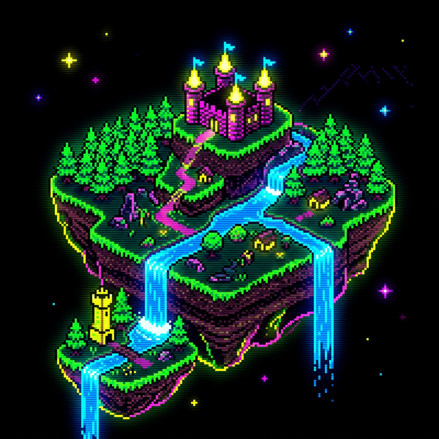

# Open Gaia

**AI-powered interactive story-worlds.** Describe any narrative and instantly generate a complete RPG game world with locations, NPCs, quests, and cinematic AI-driven dialogue — all playable in the browser.

Built for the **Mistral Worldwide Hackathon 2026**.



---

## Quick Start

```bash
# 1 — Backend
cd backend
cp .env.example .env          # add MISTRAL_API_KEY, ELEVENLABS_API_KEY, MONGODB_URL
pip install -r requirements.txt
python -m app.main             # → http://localhost:8000

# 2 — Frontend
cd frontend
npm install
npm run dev                    # → http://localhost:5173
```

> **Requires:** Python 3.10+, Node.js 18+, MongoDB (local or Atlas), Redis (optional).

---

## How It Works

| Step | What Happens | Model |
|------|-------------|-------|
| **1. Describe** | You write a story premise + end goal | — |
| **2. Generate** | AI builds a full "Game Bible": world, locations, NPCs, quests, tasks | Mistral Large |
| **3. Play** | Walk through a procedurally generated map, talk to NPCs in real-time | Mistral Small + ElevenLabs TTS |

If you make an unexpected choice during dialogue, the story dynamically branches using **Mistral Magistral Medium**.

---

## Architecture

```
┌─────────────┐          ┌──────────────────┐
│  React +    │  REST    │     FastAPI      │
│  Phaser 3   │ ◄──────► │     (Python)     │
│  (Browser)  │          │                  │
└─────────────┘          └───────┬──────────┘
                                 │
                    ┌────────────┼────────────┐
                    ▼            ▼            ▼
               Mistral AI    ElevenLabs    MongoDB
              (LLM suite)     (TTS)       (persistence)
                                 │
                              Redis
                            (cache, optional)
```

### Frontend (`/frontend`)

| Layer | Tech | Purpose |
|-------|------|---------|
| UI Framework | React 19 + Vite | Dashboard pages (Home, Create, Bible list/detail) |
| Game Engine | Phaser 3 | Top-down RPG: world map, NPC interaction, dialogue |
| State | Zustand | Shared game state between React and Phaser |
| Styling | Tailwind CSS v4 | Retro arcade theme with neon colors |
| Routing | React Router DOM | SPA navigation |

### Backend (`/backend`)

| Layer | Tech | Purpose |
|-------|------|---------|
| API | FastAPI + Uvicorn | REST endpoints for world gen, dialogue, portraits |
| LLM | Mistral AI (Large / Small / Magistral) | World building, NPC dialogue, story branching |
| Images | FLUX (via Mistral) | NPC portrait generation |
| Voice | ElevenLabs | Real-time NPC voice synthesis |
| DB | MongoDB (Motor) | Game Bible persistence |
| Cache | Redis | Response caching (optional, degrades gracefully) |

---


## API Endpoints

| Method | Path | Model | Purpose |
|--------|------|-------|---------|
| `GET` | `/` | — | Health check |
| `POST` | `/api/generate-world` | Mistral Large + FLUX | Generate full Game Bible with NPC portraits |
| `POST` | `/api/npc-dialogue` | Mistral Small + ElevenLabs | Live NPC conversation with voice |
| `POST` | `/api/branch-story` | Magistral Medium | Dynamic story branching |
| `POST` | `/api/generate-portrait` | FLUX | Single NPC portrait |

Swagger docs: http://localhost:8000/docs

---

## Environment Variables

| Variable | Required | Description |
|----------|----------|-------------|
| `MISTRAL_API_KEY` | ✅ | Mistral AI API key |
| `ELEVENLABS_API_KEY` | ✅ | ElevenLabs TTS API key |
| `MONGODB_URL` | ✅ | MongoDB connection string |
| `MONGODB_DB_NAME` | — | Database name (default: `open_gaia`) |
| `REDIS_URL` | — | Redis URL (optional, degrades gracefully) |
| `PORT` | — | Server port (default: `8000`) |
| `FRONTEND_ORIGIN` | — | CORS origin (default: `http://localhost:5173`) |

---

## Game Features

- **Procedural Map Generation** — Each world gets a unique tile-based map with terrain, landmarks, and NPC placements
- **Typewriter Dialogue** — NPC speech animates character-by-character at ~90fps with retro blip sounds
- **Trust Meter** — Build or lose trust with NPCs based on your choices
- **Voice Synthesis** — NPCs speak with AI-generated voices via ElevenLabs
- **Story Branching** — Unexpected player choices trigger dynamic narrative adaptation
- **Retro Arcade UI** — Full pixel-art aesthetic with neon glow effects and RetroGaming font

---

## License

This project was built for the Mistral Worldwide Hackathon 2026.